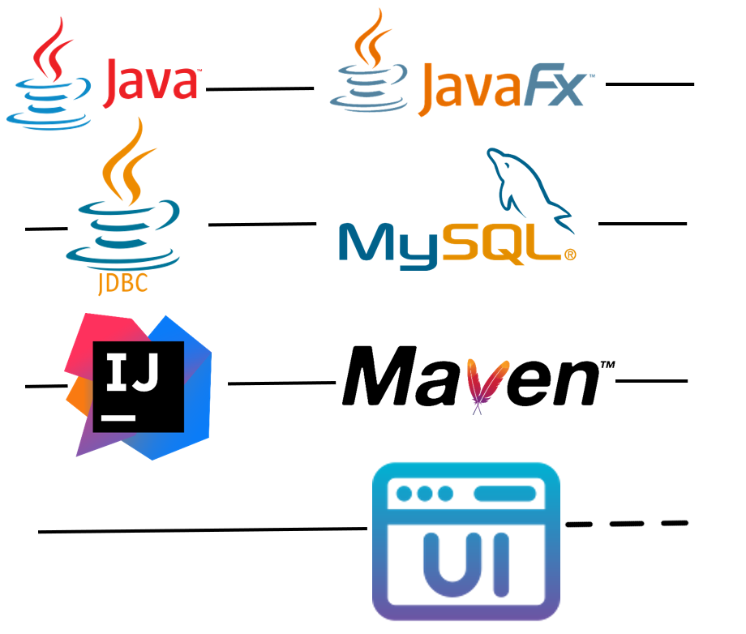

# Contact and Group Management Desktop Application
---
## Table of Contents

- [Project Overview](#project-overview)
- [Features](#features)
- [Architecture](#architecture)
- [Prerequisites](#prerequisites)
- [Installation and Configuration](#installation-and-configuration)
- [Database Configuration](#database-configuration)
- [Running the Application](#running-the-application)
- [Usage](#usage)
- [Acknowledgments](#acknowledgments)
  
---

## Project Overview
This project is a desktop application developed using `Java` and `JavaFX` frameWork for managing contacts and groups. It utilizes the `JDBC`  (Java Database Connectivity) API for interacting with a `MySQL` database.The application provides a log.txt file for tracking its logs, which is implemented using `Log4j`.The application is built as a `Maven` project and can be easily imported and managed in `IntelliJ IDEA`.

---

---

# Features
The application offers the following key features:

`Contact Management`: Users can create, update, and delete contacts. They can input contact information such as name, phone number, email address, etc.

`Group Management`: Users can add and delete contact groups. Each group can be assigned a name and can contain multiple contacts.

`Automatic Group Creation`: The application automatically creates groups based on the last name of contacts. When a new contact is added, the application checks the last name and assigns the contact to the corresponding group. If the group doesn't exist, it is created automatically (works manually).

`Contact Search`: Users can search for contacts based on various criteria, including name, phone number, email address, etc.

`Contact Details`: The application allows users to view comprehensive details of a contact, including all associated information.

---

# Architecture
The application follows a layered architecture pattern to ensure separation of concerns and maintainability. The architecture consists of the following layers:

`Database Layer`: This layer represents the database and handles all interactions with the MySQL database. It includes the implementation of the JDBC API for executing queries, updates, and managing database connections.

`Interface Human Machine (IHM) Layer`: This layer is responsible for the graphical user interface (GUI) of the application. It includes the JavaFX-based UI components and controllers that interact with the user.

`Controller Layer`: This layer acts as an intermediary between the UI layer and the business logic. It receives user actions from the UI layer, performs necessary validations and transformations, and invokes appropriate methods in the Business Objects (BO) layer.

`Business Objects (BO) Layer`: This layer contains the core business logic of the application. It encapsulates the operations and rules related to managing contacts, groups.

---

---
# Prerequisites
To run the application, ensure you have the following:

`Java Development Kit (JDK)`: Install JDK on your system and configure it in IntelliJ IDEA.

`MySQL Database`: Set up a MySQL server and ensure it is running properly.

`IntelliJ IDEA`: Install IntelliJ IDEA, the integrated development environment for Java.

---

# Installation and Configuration
To set up the project in IntelliJ IDEA, follow these steps:

`Clone` or download the project from the repository.

Open IntelliJ IDEA and select "Open" from the initial screen or go to "File" > "Open" in the menu.

Navigate to the project directory and select the root folder of the project.

IntelliJ IDEA will automatically detect the `Maven` project and import the necessary dependencies [probably you have to reload the maven project].

---

# Database Configuration
To configure the `MySQL database` connection, follow these steps:

Open the project in IntelliJ IDEA.

Locate the configuration file named conf.properties in the project's resource folder.

Open the conf.properties file and update the following properties with your MySQL database credentials:

`db.name`: Specify the name of the database (default: Contact_Mana).

`db.url`: Provide the JDBC URL for connecting to your MySQL server (default: jdbc:mysql://localhost:3306/).

`db.login`: Enter the MySQL username (default: root).

`db.password`: Enter the MySQL password (default:).

`db.driver`: Specify the JDBC driver class (default: com.mysql.cj.jdbc.Driver).

---

# Running the Application
To run the application in IntelliJ IDEA, follow these steps:

Open the project in IntelliJ IDEA.

Locate the main class (usually named Application or Main) within the project structure.

Right-click on the main class and select "Run" from the context menu.

When launching the application, the database and its tables will be automatically created if they do not already exist.

---

# Usage
Once the application is running, you will be presented with the main graphical user interface. Use the provided buttons, menus, and input fields to interact with the application and perform various operations such as adding contacts, creating groups, searching for contacts, etc.

Mainly there are three interfaces

#### Inerface 1 : `Contact`

#### Inerface 2 : `Group`

#### Inerface 3 : `About`

If you want to see how it's work, check the linkedin post where there is a vedio explain how to use it, here it is the link of the post :
<a href="https://www.linkedin.com/feed/update/urn:li:activity:7086787315267723264/" target="_blank">Click here</a>

---

# Acknowledgments
We would like to express our gratitude to the following resources for their valuable contributions to this project:

The official documentation of Java Development Kit `(JDK)` and `JavaFX`.
The documentation provided by `MySQL` for configuring and working with the database.
The `Scene Builder` documentation, which aided in creating the graphical user interface.
The application interface is inspired from an existing application. Here is the link to the GitHub repository of the application [https://github.com/marcoman2/EmployeeManagementSystem]

Feel free to customize the content and functionality of this application according to your specific requirements. You can modify the user interface, add additional features, or integrate it with other systems or APIs. The project is designed to be flexible and adaptable, allowing you to tailor it to your needs.

